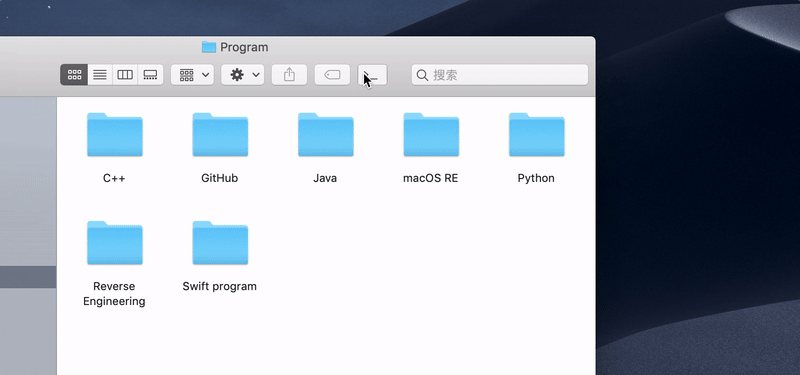

<p align="center">
  <br/><br/>
  <a href="https://github.com/Ji4n1ng/OpenInTerminal/releases/tag/0.4.1"></a>
  <a href="https://github.com/Ji4n1ng/OpenInTerminal/blob/master/LICENSE"></a>
  
  <a href="https://travis-ci.org/Ji4n1ng/OpenInTerminal"></a>
</p>
[English](./README-Lite.md) | 中文说明

## 如何使用 🚀

### 1) 在终端中打开当前目录



### 2) 在终端中打开选择的文件夹


### 3) 设置默认终端

在第一次运行应用的时候，你需要选择默认终端。


当你设置了默认终端之后，选择框将不会再出现。如果你想要重新设置默认终端，请在终端中输入以下命令。然后重新运行应用。

**版本 0.3.0**：

```
defaults remove wang.jianing.OpenInTerminal-Lite OIT_TerminalBundleIdentifier
```

<details><summary><strong>版本 0.2.0</strong>:</summary><br>
<code>defaults remove wang.jianing.OpenInTerminal OIT_TerminalBundleIdentifier</code>
<br>
</details>

<details><summary>设置 <strong>Alacritty</strong> 为默认终端:</summary><br>
<code>defaults write wang.jianing.OpenInTerminal-Lite OIT_TerminalBundleIdentifier io.alacritty </code>
<br>
</details>

### 4) 打开新的标签页或者窗口

当你在使用 `Terminal` 或者 `iTerm`，你可以设置默认打开一个新的标签页或者窗口。**默认**是打开新的窗口。

对于 `Terminal`:

```
# 打开新的标签页
defaults write wang.jianing.OpenInTerminal-Lite OIT_TerminalNewOption "tab"
# 打开新的窗口
defaults write wang.jianing.OpenInTerminal-Lite OIT_TerminalNewOption "window"
```

对于 `iTerm`:

```
# 打开新的标签页
defaults write wang.jianing.OpenInTerminal-Lite OIT_iTermNewOption "tab"
# 打开新的窗口
defaults write wang.jianing.OpenInTerminal-Lite OIT_iTermNewOption "window"
```

对于 `Hyper` 用户来说，更推荐打开新的标签页。

对于 `Alacritty` 用户来说，目前只支持打开新的窗口。

## 如何安装 🖥

### 手动安装 (最新版本：0.4.1)

1. 从 [release](https://github.com/Ji4n1ng/OpenInTerminal/releases) 中下载。
2. 将应用移动到 `应用程序` 文件夹。
3. 按住 `Cmd` 键，然后将应用拖到访达工具栏中。
4. 完成。


### Homebrew (最新版本：0.4.1)

1. 运行以下命令

   ```
   brew cask install openinterminal-lite
   ```

2. 在 `应用程序` 文件夹中，按住 `Cmd` 键，然后将应用拖到访达工具栏中。

3. 完成

>  ⚠️ 当您第一次运行应用程序时，macOS 将要求访问 `访达` 和 `终端`（或 `iTerm`）的权限。请给予应用程序权限。

### 如果你正在使用深色模式 (Dark Mode)

我在 [release](https://github.com/Ji4n1ng/OpenInTerminal/releases) 中提供了几个图标。 您可以右键单击该应用程序并选择 `显示简介`。 拖动图标进行更改。


## 常见问题 ❓

<details><summary>1. 我不小心点了不授权的按钮</summary><br>
<p>你可以运行以下命令。这会重置系统设置里的权限。</p>
<pre><code>tccutil reset AppleEvents</code></pre>
</details>

<details><summary>2. 路径里的特殊字符</summary><br>
<p>请不要在路径中使用反斜线 <code>\</code> 和双引号 <code>"</code>。</p>
</details>

## 版本变动 🗒

**version 0.4.1**

- 支持 `Alacritty`

**version 0.4.0**

- 当使用 `Terminal` 和 `iTerm` 的时候，你可以设置默认打开新的标签页或者窗口。

**version 0.3.0**

- 更名为 `OpenInTerminal-Lite` (`OpenInTerminal` 将会在未来以功能更强大的版本出现)
- 解决了当打开 Hyper 的时候，特殊字符导致程序崩溃的 bug

<details><summary>旧版本</summary><br>
<p><strong>version 0.2.0</strong></p>
<ul>
<li>增加终端选择框</li>
<li>在打开 iTerm 的时候，取消执行 <code>clear</code> 命令</li>
</ul>
<p><strong>version 0.1.1</strong></p>
<ul>
<li>支持 <code>Hyper</code></li>
<li>在打开 iTerm 的时候，优先新建一个 tab 标签页。</li>
</ul>
<p><strong>version 0.1.0</strong></p>
<ul>
<li>第一次 release</li>
</ul>
<br>
</details>

## 特别感谢 ❤️

### 贡献者

- [Camji55](https://github.com/Camji55)

### 参考项目

- [jbtule/cdto](https://github.com/jbtule/cdto)
- [es-kumagai/OpenTerminal](https://github.com/es-kumagai/OpenTerminal)
- [tingraldi/SwiftScripting](https://github.com/tingraldi/SwiftScripting)