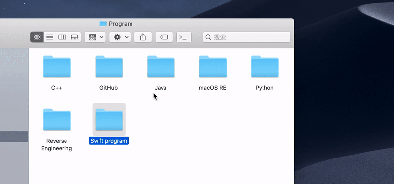
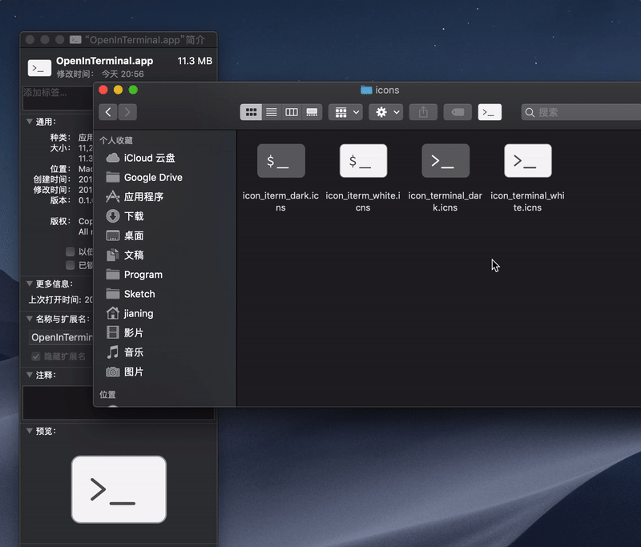

 # OpenInTerminal

一个可以在终端（[`iTerm`](https://www.iterm2.com/) 或 [`Hyper`](https://github.com/zeit/hyper)）中打开当前目录的访达工具栏应用程序。

## 如何使用 🚀

### 1) 在终端中打开当前目录


### 2) 在终端中打开选择的文件夹



### 3) 设置默认终端

在第一次运行应用的时候，你需要选择默认终端。


当你设置了默认终端之后，选择框将不会再出现。如果你想要重新设置默认终端，请在终端中输入以下命令。然后重新运行应用。

```
defaults remove wang.jianing.OpenInTerminal OIT_TerminalBundleIdentifier
```

## 如何安装 🖥

### Homebrew

1. 运行以下命令

   ```
   brew cask install openinterminal
   ```

2. 在 `应用程序` 文件夹中，按住 `Cmd` 键，然后将应用拖到访达工具栏中。

3. 完成


### 手动安装

1. 从 [release](https://github.com/Ji4n1ng/OpenInTerminal/releases) 中下载。
2. 将应用移动到 `应用程序` 文件夹.
3. 按住 `Cmd` 键，然后将应用拖到访达工具栏中。
4. 完成。

>  ⚠️ 当您第一次运行应用程序时，macOS 将要求访问 `访达` 和 `终端`（或 `iTerm`）的权限。请给予应用程序权限。

### 如果你正在使用深色模式 (Dark Mode)

我在 [release](https://github.com/Ji4n1ng/OpenInTerminal/releases) 中提供了几个图标。 您可以右键单击该应用程序并选择 `显示简介`。 拖动图标进行更改。



## 如何构建 🔨

`Mojave build passing ✅`

```
git clone https://github.com/Ji4n1ng/OpenInTerminal
cd OpenInTerminal
xcodebuild
```

## 将要做的事 👨‍💻

- ~~根据深色模式（Dark  Mode）动态替换暗色图标~~

如果你有好的想法，欢迎去新建一个 `issue` 来讨论。

## 版本变动 🗒

**version 0.2.0**

- 增加终端选择框
- 在打开 iTerm 的时候，取消执行 `clear` 命令

**version 0.1.1**

- 支持 `Hyper`
- 在打开 iTerm 的时候，优先新建一个 tab 标签页。

**version 0.1.0**

- 第一次 release

## 特别感谢 ❤️

### 贡献者

- [Camji55](https://github.com/Camji55)

### 参考项目

- [jbtule/cdto](https://github.com/jbtule/cdto)
- [es-kumagai/OpenTerminal](https://github.com/es-kumagai/OpenTerminal)
- [tingraldi/SwiftScripting](https://github.com/tingraldi/SwiftScripting)