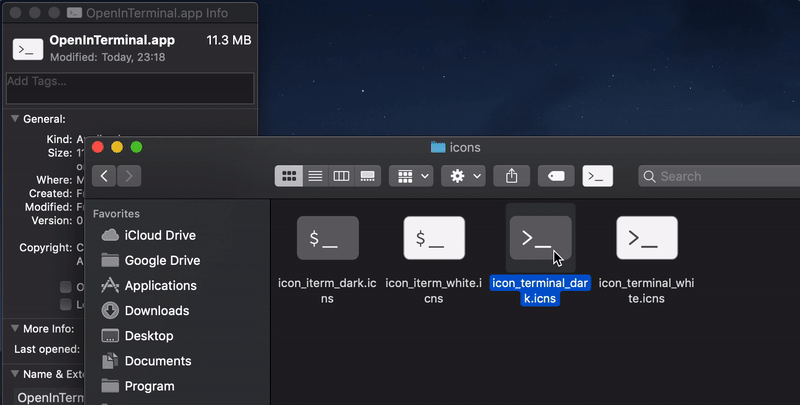

 # OpenInTerminal

✨ Finder Toolbar app for macOS to open the current directory in `Terminal` or `iTerm`. 

[中文说明](./README-zh.md)

## How to use 🚀

### 1) Open Current Directory from Toolbar


### 2) Open Selected folder or file from Toolbar


### 3) Other

If neither Finder window is opened nor the folder is selected, this app will open `home directory` in `Terminal` or `iTerm`.

## How to Install 🖥

1. Download from [release](https://github.com/Ji4n1ng/OpenInTerminal/releases).
2. Move the app into `/Applications`.
3. Right click on the Finder toolbar. Choose `Customize Toolbar`. Drag the app into Finder Toolbar.
4. Done.

>  ⚠️ macOS will ask your permissions to access Finder and Terminal (or iTerm) when you run the app for the first time. Please give the application permissions.


### If you are using Dark Mode

I provided several icons along with the app in the release. You can right click on the app and select `Get Info`. Drag the icon to cover the default icon.



## How to build 🔨

`Mojave build passing ✅`

```
git clone https://github.com/Ji4n1ng/OpenInTerminal
cd OpenInTerminal
xcodebuild
```

> If you want to change default terminal, edit it in `main.swift`. I will try my best to solve this problem in a more elegant way.

## TODO 👨‍💻

1. Dynamically change icon depending on Dark Mode.
2. User can choose which terminal to open.
3. 🐞 Fix: If path include `\`, the app will crash when openning in iTerm.

## Special Thanks to ❤️

- [jbtule/cdto](https://github.com/jbtule/cdto)
- [es-kumagai/OpenTerminal](https://github.com/es-kumagai/OpenTerminal)
- [tingraldi/SwiftScripting](https://github.com/tingraldi/SwiftScripting)