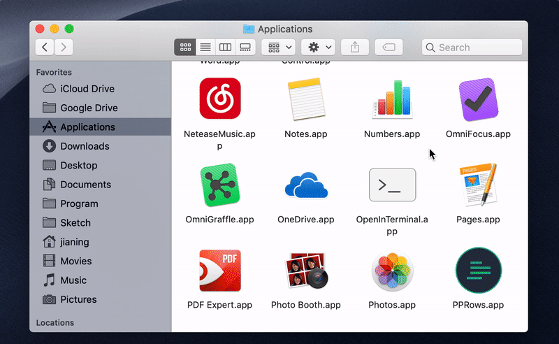

<p align="center">
  <br/><br/>
  <a href="https://github.com/Ji4n1ng/OpenInTerminal/releases/tag/0.4.0"></a>
  <a href="https://github.com/Ji4n1ng/OpenInTerminal/blob/master/LICENSE"></a>
  
  <a href="https://travis-ci.org/Ji4n1ng/OpenInTerminal"></a>
</p>

[中文说明](./README-zh.md)

## How to use 🚀

### 1) Open current directory from toolbar


### 2) Open selected folder or file from Toolbar


### 3) Set default terminal

You are asked to set the default terminal to open after first launch.


The selection box will not appear after you have set the default terminal. If you want to reset the default terminal, please enter the following command in the terminal. Then just run the application again.

For **version 0.3.0 and above**:

```
defaults remove wang.jianing.OpenInTerminal-Lite OIT_TerminalBundleIdentifier
```

For **version 0.2.0**:

```
defaults remove wang.jianing.OpenInTerminal OIT_TerminalBundleIdentifier
```

### 4) Open in a new Tab or Window

When you are using `Terminal` and `iTerm`, you can set a default to open a new tab or window. The **default** is to open a new window. 

For `Terminal`:

```
# Open a new Tab
defaults write wang.jianing.OpenInTerminal-Lite OIT_TerminalNewOption "tab"
# Open a new Window
defaults write wang.jianing.OpenInTerminal-Lite OIT_TerminalNewOption "window"
```

For `iTerm`:

```
# Open a new Tab
defaults write wang.jianing.OpenInTerminal-Lite OIT_iTermNewOption "tab"
# Open a new Window
defaults write wang.jianing.OpenInTerminal-Lite OIT_iTermNewOption "window"
```

For `Hyper` users, it is more recommended to open a new tab.

## How to install 🖥

> Because updates are frequent, it is recommended to manually download the latest version.

### Manual (latest version: 0.4.0)

1. Download from [release](https://github.com/Ji4n1ng/OpenInTerminal/releases).
2. Move the app into `/Applications`.
3. Hold down the `Cmd` key and drag the app into Finder Toolbar.
4. Done.



### Homebrew (current version 0.4.0)

1. Run the following command

   ```
   brew cask install openinterminal-lite
   ```

2. In `/Applications` folder, hold down the `Cmd` key and drag the app into Finder Toolbar.

3. Done

>  ⚠️ macOS will ask your permissions to access Finder and Terminal (iTerm or Hyper) when you run the app for the first time. Please give the application permissions.

### If you are using Dark Mode

I provided several icons along with the app in the [release](https://github.com/Ji4n1ng/OpenInTerminal/releases). You can right click on the app and select `Get Info`. Drag the icon to cover the default icon.


## Todo 👨‍💻

- Drop down menu in `FinderSync Extension`  ✅ By [Camji55](https://github.com/Camji55)
- `Preferences` panel which can allow users to set up to open new windows or new tabs. ✅
- Open in `VSCode` / `Atom` / `Sublime`? (This needs discussion)
- Supporting keyboard shortcuts


If you have a good idea, feel welcome to open a new [issue](https://github.com/Ji4n1ng/OpenInTerminal/issues/new/choose).

## FAQ ❓

<details><summary>1. I accidentally clicked on the <code>Don't Allow</code>  button.</summary><br>
<p>You can run the following command in the terminal. This will reset the permissions in the System Preferences.</p>
<pre><code>tccutil reset AppleEvents
</code></pre>
</details>
<details><summary>2. Special characters in the <code>path</code>.</summary><br>
<p>Please do not use backslash <code>\</code> and double quotes <code>"</code>   in the path</p>
</details>

## Changes 🗒

**version 0.4.0**

- You can set a default to open a new tab or window when using `Terminal` and `Hyper`.

**version 0.3.0**

- Change name to `OpenInTerminal-Lite` (`OpenInTerminal` will come as a more powerful version in the future.)
- Fix a bug that some special characters in the path would crash the program when opening Hyper.

<details><summary>old version</summary><br>
<p><strong>version 0.2.0</strong></p>
<ul>
<li>Add terminal selector</li>
<li>Cancel running <code>clear</code> command when opening iTerm</li>
</ul>
<p><strong>version 0.1.1</strong></p>
<ul>
<li>Support <code>Hyper</code></li>
<li>Give priority to creating a new tab when opening iTerm</li>
</ul>
<p><strong>version 0.1.0</strong></p>
<ul>
<li>First release</li>
</ul>
<br>
</details>

## Special Thanks to ❤️

### Contributors

- [Camji55](https://github.com/Camji55)

### Reference projects

- [jbtule/cdto](https://github.com/jbtule/cdto)
- [es-kumagai/OpenTerminal](https://github.com/es-kumagai/OpenTerminal)
- [tingraldi/SwiftScripting](https://github.com/tingraldi/SwiftScripting)
